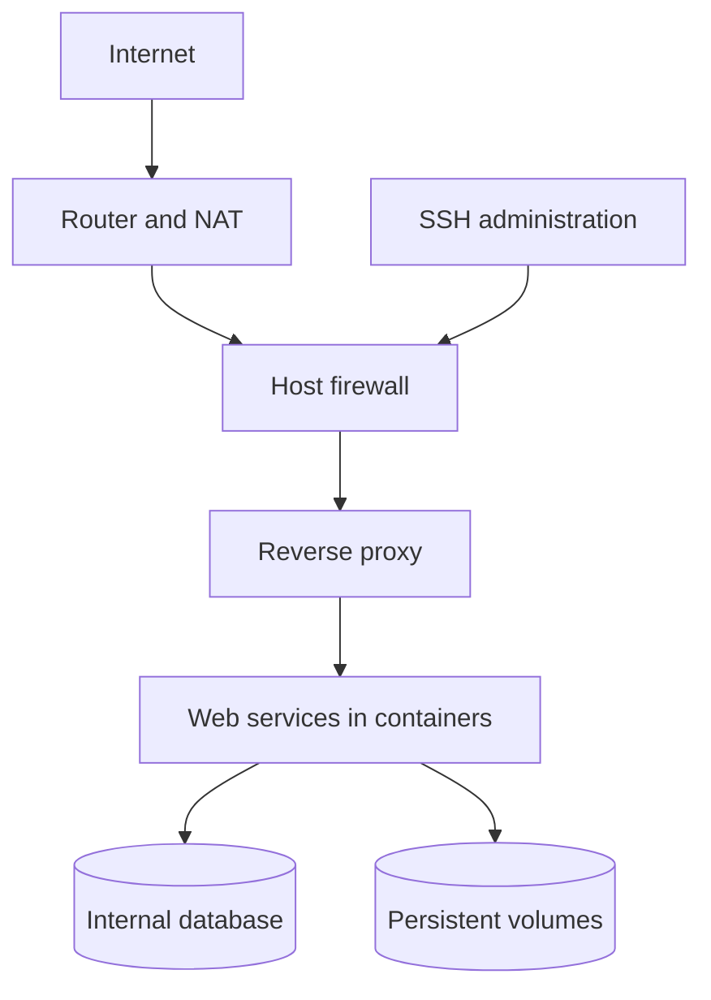
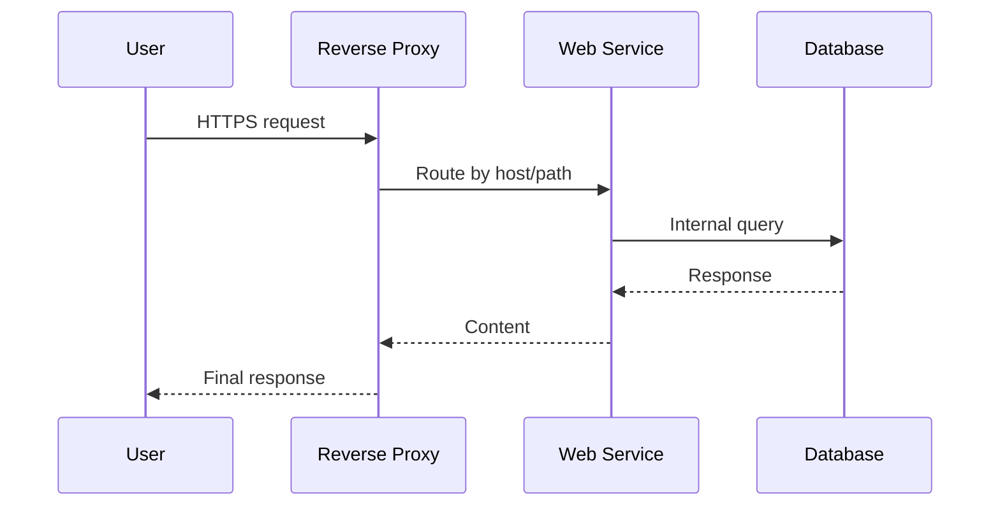

# 3. System architecture

## Chapter goal

This chapter defines the server base architecture: how layers are separated, how traffic flows, and how services are organized to keep the system maintainable and secure from day one.

The goal is not to overcomplicate. The goal is to build a clear base that can grow without a full rebuild.

## High-level view

## Principles behind this architecture

1. One web entry point.
2. Decoupled services in containers.
3. Persistent data outside images.
4. No public database exposure.
5. Layered operations to simplify diagnostics.

## Layers and responsibilities

| Layer         | Purpose                     | Practical rule                  |
| ------------- | --------------------------- | ------------------------------- |
| Edge network  | Traffic ingress and egress  | Expose only what is required    |
| Host          | Base system and security    | Keep host software minimal      |
| Reverse proxy | Domain/path routing and TLS | HTTPS by default                |
| Application   | Functional services         | One service, one responsibility |
| Data          | Persistent state            | Verified backup and restore     |

## Web request flow

## Container network design

Network separation reduces mistakes and risk.

- Public network: for services receiving external traffic through the proxy.
- Private data network: for database and internal-only services.

Simple rule:

- If a service does not need internet-facing access, it should not be in the public network.
- If a service does not need database access, it should not be in the private data network.

## Storage design

Do not keep important state inside container layers.

Recommended approach:

- Versioned code and configuration.
- Application data in persistent volumes.
- Scheduled backups of database and critical volumes.

Logical distribution example (fictional values used for illustration):

| Data type        | Logical location         |
| ---------------- | ------------------------ |
| Base system      | System disk              |
| Application data | Persistent volumes       |
| Local backups    | Separate data area       |
| Operational logs | Dedicated logs directory |

## Services that fit this baseline

With this architecture, a phased rollout is realistic:

1. Reverse proxy and certificates.
2. Personal cloud.
3. Smart-home services.
4. Secure VPN access.
5. Custom web applications.
6. Streaming and media services.

## Recommended tools by layer

| Layer                   | Primary recommendation       | Common alternative            | Recommended use                      |
| ----------------------- | ---------------------------- | ----------------------------- | ------------------------------------ |
| Proxy and TLS           | Traefik                      | Nginx Proxy Manager           | Publish services with HTTPS          |
| Local orchestration     | Docker Compose               | Portainer (visual management) | Deployment and day-to-day operations |
| Database                | Internal MySQL or PostgreSQL | MariaDB                       | Stateful services                    |
| Monitoring              | Netdata                      | Grafana + Prometheus          | System health and alerts             |
| Advanced web protection | ModSecurity (WAF)            | Proxy rules + rate limiting   | Hostile public traffic scenarios     |

### How to choose between Traefik and Nginx Proxy Manager

- Traefik is usually better if you deploy with containers and want label-based automation.
- Nginx Proxy Manager is usually better if you prefer a visual panel and simpler manual management.

Both are valid for HTTPS and routing. The key is choosing one and keeping a consistent operating pattern.

### Recommended first-version implementation

1. Reverse proxy with HTTPS.
2. One or two application services.
3. Internal non-public database.
4. Basic monitoring and backup.

This order helps the architecture scale in a stable way without early technical debt.

## Recommended deployment order

1. Validate host and basic network.
2. Bring up reverse proxy.
3. Publish one simple test service.
4. Enable persistence and backups.
5. Add internal database layer.
6. Add business services one by one.

Each step is validated before moving to the next one.

## Architecture validation checklist

- External access enters through a single point.
- Database has no public exposure.
- Each service is connected only to required networks.
- Data survives container recreation.
- Backup and restore process exists and is tested.
- Services recover automatically after reboot.

## Common architecture mistakes

1. Exposing too many ports for convenience.
2. Mixing application data with base system data.
3. Using one flat network for everything.
4. Adding services without order or validation.
5. Never testing backup restoration.

## Practical recommendations

- Design service map and dependencies first.
- Start with the minimum viable stack and scale by layers.
- Document each service with: purpose, ports, networks, and volumes.
- Reuse the same deployment pattern to avoid operational drift.

## Note on fictional values

If this chapter includes sample domains, IPs, users, ports, or paths, those values are fictional.

To use real values in your environment, follow official documentation for each tool and validate with system inspection commands.
