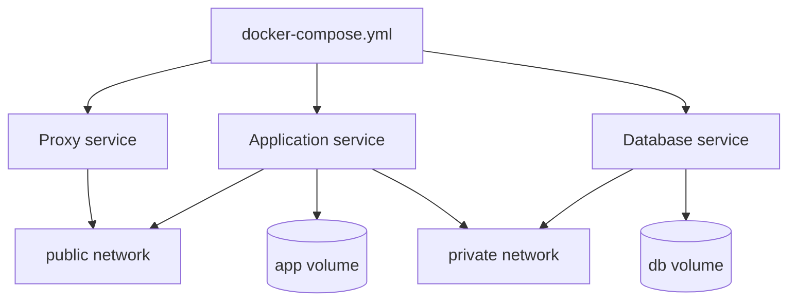

# 5. Docker and service management

## Chapter goal

This chapter explains how to use Docker to deploy services in a structured, reproducible, and maintainable way.

The main shift is moving from "installing isolated tools" to "defining infrastructure as code".

## Why Docker in this project

Docker solves three common problems:

1. Different dependencies across services.
2. Service updates without breaking the whole system.
3. Fast recovery when something fails.

With containers, each service has its own runtime and follows the same operational pattern.

## Recommended tools in this layer

| Need                | Primary recommendation | Alternative               | When to use                          |
| ------------------- | ---------------------- | ------------------------- | ------------------------------------ |
| Run services        | Docker Engine          | Podman                    | Baseline for this architecture       |
| Local orchestration | Docker Compose         | Compose through Portainer | Stack management by files            |
| Visual management   | Portainer              | Cockpit with plugins      | If you prefer panel-based operations |
| HTTPS publishing    | Traefik                | Nginx Proxy Manager       | Public web services                  |
| Image sources       | Docker Hub + GHCR      | Private registry          | Image retrieval and versioning       |

## Core concepts you should control

- Image: service template.
- Container: running instance.
- Volume: persistent data outside container layers.
- Docker network: controlled communication between services.
- Compose: declarative file to run complete stacks.

If you control these five concepts, you can operate most self-hosting services.

## Recommended stack structure



## How to deploy without overcomplicating

### Step 1: prepare baseline

1. Install Docker Engine.
2. Install Docker Compose plugin.
3. Verify user can run Docker commands.

### Step 2: define service stack with Compose

Use one file per stack including:

- pinned image versions.
- restart policy.
- persistent volumes.
- separated networks when required (public/private).
- environment variables without publishing secrets.

Simplified example (fictional values):

```yaml
services:
  app:
    image: app-image:1.0.0
    restart: unless-stopped
    networks:
      - public
      - private
    volumes:
      - app-data:/var/lib/app

  db:
    image: db-image:1.0.0
    restart: unless-stopped
    networks:
      - private
    volumes:
      - db-data:/var/lib/db

volumes:
  app-data:
  db-data:

networks:
  public:
  private:
    internal: true
```

### Step 3: publish through a reverse proxy

- If you want label-based automation, Traefik usually fits better.
- If you want visual domain/certificate management, Nginx Proxy Manager is often simpler at first.

### Step 4: validate

- Container starts without restart loops.
- Service responds on internal network.
- HTTPS works for public services.
- Data persists after restart/recreation.

## Volumes and data strategy

Core rule: if data matters, it must live in a persistent volume.

Data that should persist:

- Database data.
- User-uploaded files.
- Application configuration state.

Good practices:

- Do not keep critical data in temporary paths.
- Use explicit volume naming.
- Keep backup and restore process tested.

## Network strategy

To avoid unnecessary exposure:

- Public services in a public network behind the proxy.
- Database only on private internal network.
- Admin tools preferably non-public.

If a service does not need internet-facing access, it should not be in the public network.

## Updating without downtime chaos

Recommended flow:

1. Read image changelog first.
2. Create a backup snapshot.
3. Update one service at a time.
4. Check logs and health state.
5. Roll back immediately if validation fails.

## Common Docker mistakes

1. Using latest everywhere without version control.
2. Exposing internal ports for convenience.
3. Storing secrets in public repositories.
4. Not separating networks by traffic type.
5. Not testing backup restoration.

## Quality checklist per stack

- Image version pinned.
- Restart policy set.
- Persistent volumes declared.
- Networks separated by need.
- Secrets kept outside public files.
- Logs and health checks reviewed.
- Backup and restore tested.

## Final recommendations

- Keep stacks small and responsibility-focused.
- Document each stack with purpose and dependencies.
- Avoid deploying many major changes at once.
- Prioritize operational stability over service quantity.

## Note on fictional values

Any sample domain, IP, user, port, path, or credential shown in this chapter is fictional.

For real values, follow official Docker docs, proxy documentation, and each service's official documentation.
