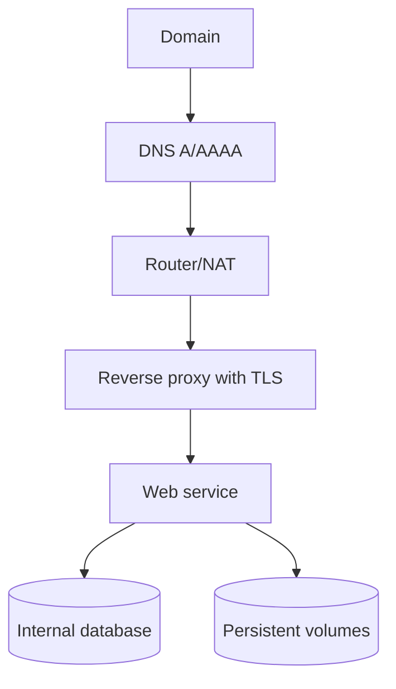

# 6. Deployment and self-hosting

## Chapter goal

This chapter explains how to move from a local application to a publicly available service in a secure, stable, and maintainable way.

The target is a repeatable process: prepare, deploy, validate, and operate.

## What a good deployment means

A deployment is considered correct when it meets these points:

- The service starts reliably after reboot.
- Public access works over HTTPS.
- Data persists when containers are recreated.
- A clear rollback path exists.
- A post-deployment validation checklist is used.

## Recommended deployment architecture



## Recommended tools at this stage

| Need                   | Primary recommendation | Alternative           | When to use                      |
| ---------------------- | ---------------------- | --------------------- | -------------------------------- |
| Proxy and certificates | Traefik                | Nginx Proxy Manager   | Publish HTTPS services           |
| Stack operations       | Docker Compose         | Portainer             | Deployment and maintenance       |
| Dynamic DNS            | DDNS client            | Registrar-managed DNS | If public IP is dynamic          |
| HTTP testing           | curl                   | Browser + devtools    | Functional and header validation |
| Observability          | Netdata                | Logs + basic alerts   | Health checks after deployments  |

## Deployment flow by phases

### Phase 1: prepare baseline

1. Verify host status.
2. Verify proxy and certificate flow.
3. Confirm DNS points to the correct target.
4. Confirm required public ports are available.

### Phase 2: prepare application

1. Pin image version or use reproducible build.
2. Define environment variables without exposing secrets.
3. Configure persistent volumes.
4. Set healthcheck and restart policy.

Simplified service example (fictional values):

```yaml
services:
  web-app:
    image: web-app:1.0.0
    restart: unless-stopped
    networks:
      - public
      - private
    volumes:
      - app-data:/var/lib/app
    healthcheck:
      test: ["CMD", "wget", "-qO-", "http://localhost:8080/health"]
      interval: 30s
      timeout: 5s
      retries: 3
```

### Phase 3: publish

1. Start service in detached mode.
2. Verify container state.
3. Review startup logs.
4. Test internal health endpoint.
5. Test public HTTP and HTTPS access.

### Phase 4: harden and close

1. Force HTTP to HTTPS redirection.
2. Confirm security headers.
3. Block sensitive routes on web layer.
4. Confirm internal-only services are not publicly exposed.

## Post-deployment validation (short runbook)

Minimum checklist:

- Container state is healthy.
- Health endpoint responds.
- Domain responds over HTTPS.
- Certificate is valid and not expired.
- HTTP redirects to HTTPS.
- Sensitive routes return 403 or 404.
- Data persists after service restart.

## Fast rollback

Recommended strategy:

1. Keep a known stable previous version.
2. If release fails, revert only the affected service.
3. Validate state and health after rollback.
4. Document root cause and fix before retry.

Do not attempt to fix a failed deployment by changing many things at once.

## Common mistakes when publishing services

1. Publishing first and validating later.
2. Mixing secrets with public configuration.
3. Accidentally exposing the database.
4. Using latest without version control.
5. Skipping restart and recovery testing.
6. Ignoring certificate lifecycle until failure.

## Practical recommendations

- Deploy one service at a time.
- If something breaks, return to last stable state.
- Keep a change log for each release.
- Reuse the same validation checklist every time.

## How to scale after baseline is stable

Once baseline is stable, you can expand with:

- More self-hosting services.
- Stricter network segmentation.
- Availability and certificate-expiry alerts.
- Tiered backup policy (daily, weekly, monthly).

Scale by phases, never by piling up uncontrolled changes.

## Note on fictional values

Any sample domain, IP, user, port, path, or credential shown in this chapter is fictional.

To configure real values, follow official documentation for your proxy, DNS provider, and each deployed service.
