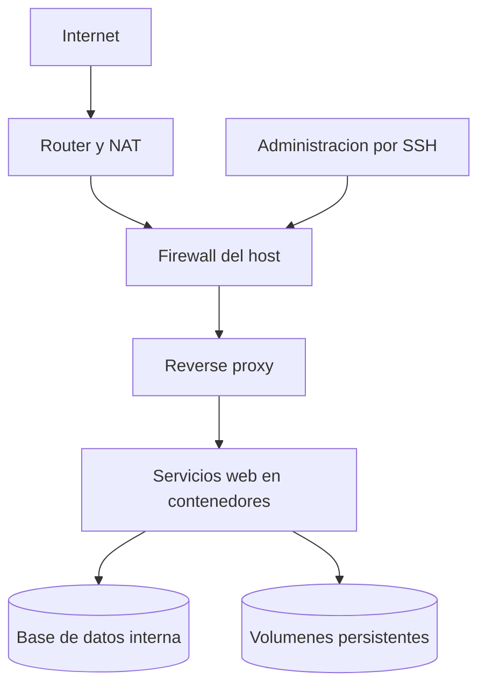
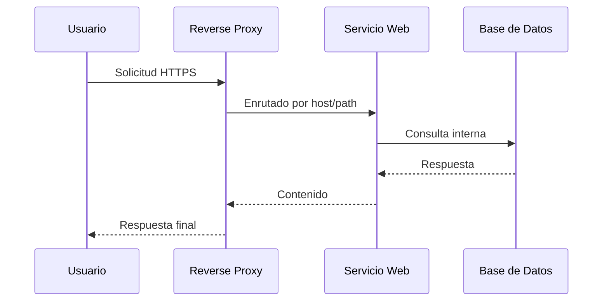

# 3. Arquitectura del sistema

## Objetivo del capitulo

En este capitulo se define la arquitectura base del servidor: como se separan capas, como fluye el trafico y como organizar servicios para que el sistema sea mantenible y seguro desde el primer dia.

La idea no es complicar. La idea es montar una base clara que luego permita crecer sin rehacer todo.

## Vista general

## Principios que guian esta arquitectura

1. Un solo punto de entrada web.
2. Servicios desacoplados en contenedores.
3. Datos persistentes fuera de imagenes.
4. Base de datos sin exposicion publica.
5. Operacion por capas para facilitar diagnostico.

## Capas y responsabilidades

| Capa          | Funcion                    | Regla practica                     |
| ------------- | -------------------------- | ---------------------------------- |
| Red de borde  | Entrada/salida de trafico  | Exponer solo lo necesario          |
| Host          | Sistema base y seguridad   | Minimo software en host            |
| Proxy reverso | Enrutado por dominio y TLS | Todo HTTPS por defecto             |
| Aplicacion    | Servicios funcionales      | Un servicio, una responsabilidad   |
| Datos         | Estado persistente         | Backup y restauracion verificables |

## Flujo de una peticion web

## Diseno de redes en contenedores

Separar redes reduce errores y riesgo.

- Red publica: para servicios que reciben trafico externo a traves del proxy.
- Red privada de datos: para base de datos y servicios internos.

Regla simple:

- Si un servicio no necesita internet, no debe estar en red publica.
- Si un servicio no necesita hablar con base de datos, no debe tocar red privada de datos.

## Diseno de almacenamiento

No guardar estado importante dentro del contenedor.

Estrategia recomendada:

- Codigo y configuracion versionados.
- Datos de aplicacion en volumen persistente.
- Copias periodicas de base de datos y volumenes criticos.

Ejemplo de reparto logico (dato inventado para ilustrar):

| Tipo de dato          | Ubicacion logica         |
| --------------------- | ------------------------ |
| Sistema base          | Disco de sistema         |
| Datos de aplicaciones | Volumenes persistentes   |
| Backups locales       | Zona separada de datos   |
| Logs de operacion     | Carpeta dedicada de logs |

## Servicios que encajan bien en esta base

Con esta arquitectura, es razonable desplegar por fases:

1. Proxy reverso y certificados.
2. Nube personal.
3. Domotica.
4. VPN de acceso seguro.
5. Aplicaciones web propias.
6. Streaming y servicios multimedia.

## Herramientas recomendadas por capa

| Capa                   | Recomendacion principal      | Alternativa habitual         | Uso recomendado               |
| ---------------------- | ---------------------------- | ---------------------------- | ----------------------------- |
| Proxy y TLS            | Traefik                      | Nginx Proxy Manager          | Publicar servicios con HTTPS  |
| Orquestacion local     | Docker Compose               | Portainer (gestion visual)   | Despliegue y operacion diaria |
| Base de datos          | MySQL o PostgreSQL (interno) | MariaDB                      | Servicios con estado          |
| Monitorizacion         | Netdata                      | Grafana + Prometheus         | Salud de sistema y alertas    |
| Seguridad web avanzada | ModSecurity (WAF)            | Reglas de proxy + rate limit | Escenarios con trafico hostil |

### Como elegir entre Traefik y Nginx Proxy Manager

- Traefik encaja mejor si despliegas con contenedores y quieres automatizacion por etiquetas.
- Nginx Proxy Manager encaja mejor si prefieres un panel visual y gestion manual sencilla.

Ambos sirven para HTTPS y enrutado. La clave es elegir uno y mantener un patron operativo consistente.

### Implementacion recomendada en una primera version

1. Proxy reverso con HTTPS.
2. Uno o dos servicios de aplicacion.
3. Base de datos interna no expuesta.
4. Monitorizacion basica y backup.

Con este orden, la arquitectura crece de forma estable y sin deuda tecnica temprana.

## Orden recomendado de despliegue

1. Validar host y red basica.
2. Levantar proxy reverso.
3. Publicar un servicio sencillo de prueba.
4. Activar persistencia y backup.
5. Incorporar base de datos interna.
6. Añadir servicios de negocio uno a uno.

Cada paso se valida antes de pasar al siguiente.

## Checklist de validacion de arquitectura

- El acceso externo entra por un unico punto.
- La base de datos no tiene exposicion publica.
- Cada servicio conoce solo las redes que necesita.
- Los datos sobreviven a recreacion de contenedores.
- Existe procedimiento de backup y restauracion probado.
- El sistema puede reiniciar y recuperar servicios automaticamente.

## Errores comunes al definir arquitectura

1. Exponer demasiados puertos por comodidad.
2. Mezclar datos de aplicacion con datos del sistema base.
3. Usar una sola red para todo.
4. Añadir servicios sin orden ni validacion previa.
5. No probar restauracion de backups.

## Recomendaciones practicas

- Diseña primero el mapa de servicios y dependencias.
- Empieza por lo minimo viable y crece por capas.
- Documenta cada servicio con: objetivo, puertos, redes y volumenes.
- Repite siempre el mismo patron de despliegue para evitar caos operativo.

## Nota sobre datos inventados

Si en este capitulo aparece un dominio, IP, usuario, puerto o ruta como ejemplo, ese valor es inventado.

Para usar valores reales en tu entorno, consulta documentacion oficial de cada herramienta y valida con comandos de inspeccion del propio sistema.
