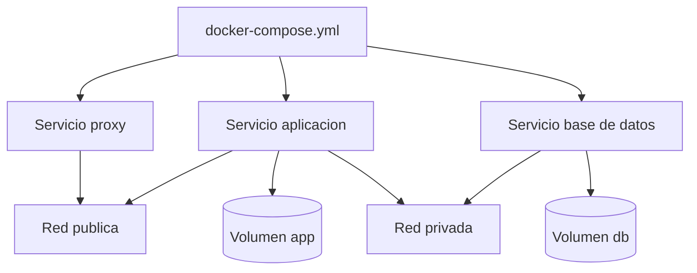

# 5. Docker y gestion de servicios

## Objetivo del capitulo

En este capitulo se explica como usar Docker para desplegar servicios de forma ordenada, reproducible y mantenible.

La idea principal es pasar de "instalar cosas sueltas" a "definir infraestructura como codigo".

## Por que Docker en este proyecto

Docker simplifica tres problemas habituales:

1. Dependencias distintas entre servicios.
2. Actualizaciones sin romper todo el sistema.
3. Recuperacion rapida tras errores.

Con contenedores, cada servicio tiene su propio entorno y se gestiona con el mismo patron operativo.

## Herramientas recomendadas en esta capa

| Necesidad            | Recomendacion principal | Alternativa          | Cuándo usarla                       |
| -------------------- | ----------------------- | -------------------- | ----------------------------------- |
| Ejecutar servicios   | Docker Engine           | Podman               | Base obligatoria de la arquitectura |
| Orquestacion local   | Docker Compose          | Compose en Portainer | Gestion de stacks por archivos      |
| Gestion visual       | Portainer               | Cockpit con plugins  | Si prefieres panel para operar      |
| Publicacion HTTPS    | Traefik                 | Nginx Proxy Manager  | Servicios web expuestos             |
| Catalogo de imagenes | Docker Hub + GHCR       | Registro privado     | Descarga y versionado de imagenes   |

## Conceptos operativos que debes dominar

- Imagen: plantilla del servicio.
- Contenedor: instancia en ejecucion.
- Volumen: datos persistentes fuera del contenedor.
- Red Docker: comunicacion controlada entre servicios.
- Compose: archivo declarativo para levantar stacks completos.

Si controlas estos cinco conceptos, puedes operar la mayoria de servicios de selfhosting.

## Estructura recomendada de un stack



## Como desplegar sin complicarte

### Paso 1: preparar base

1. Instalar Docker Engine.
2. Instalar Docker Compose plugin.
3. Verificar que el usuario puede ejecutar Docker.

### Paso 2: definir servicio con Compose

Usa un archivo por stack con:

- image fija por version.
- restart policy.
- volumenes persistentes.
- redes separadas (publica/privada cuando aplique).
- variables de entorno sin secretos en texto publico.

Ejemplo simplificado (datos ficticios):

```yaml
services:
  app:
    image: app-image:1.0.0
    restart: unless-stopped
    networks:
      - public
      - private
    volumes:
      - app-data:/var/lib/app

  db:
    image: db-image:1.0.0
    restart: unless-stopped
    networks:
      - private
    volumes:
      - db-data:/var/lib/db

volumes:
  app-data:
  db-data:

networks:
  public:
  private:
    internal: true
```

### Paso 3: publicar con proxy

- Si quieres automatizacion basada en etiquetas de contenedor, Traefik suele encajar mejor.
- Si quieres panel visual para gestionar dominios y certificados, Nginx Proxy Manager suele ser mas facil al principio.

### Paso 4: validar

- El contenedor arranca sin bucles de reinicio.
- El servicio responde en red interna.
- HTTPS funciona en servicios publicos.
- Datos persisten tras reinicio/recreacion.

## Estrategia de volumenes y datos

Regla clave: si un dato importa, debe vivir en volumen persistente.

Tipos de datos a persistir:

- Base de datos.
- Archivos subidos por usuarios.
- Configuraciones de aplicacion.

Buenas practicas:

- No usar rutas temporales para datos criticos.
- Etiquetar volumenes con nombres claros.
- Tener backup y prueba de restauracion.

## Estrategia de redes

Para evitar exposiciones innecesarias:

- Servicios publicos en red publica a traves de proxy.
- Base de datos solo en red privada interna.
- Herramientas de administracion preferiblemente no publicas.

Si un servicio no necesita internet, no debe estar en la red publica.

## Actualizaciones sin dolor

Proceso recomendado:

1. Revisar changelog de imagen.
2. Crear backup previo.
3. Actualizar servicio concreto, no todo a la vez.
4. Verificar logs y salud.
5. Si falla, rollback inmediato a version anterior.

## Errores frecuentes en Docker

1. Usar latest en todos los servicios sin control de versiones.
2. Exponer puertos internos por comodidad.
3. Guardar secretos en repositorio.
4. No separar redes por tipo de trafico.
5. No comprobar restauracion de backups.

## Checklist de calidad para cada stack

- Imagen fijada por version.
- Politica de reinicio definida.
- Volumenes persistentes declarados.
- Redes separadas segun necesidad.
- Secretos fuera de archivos publicos.
- Logs y health checks revisados.
- Backup y restauracion probados.

## Recomendaciones finales

- Mantener stacks pequenos y con responsabilidad unica.
- Documentar cada stack con objetivo y dependencias.
- No desplegar varios cambios grandes a la vez.
- Priorizar estabilidad sobre cantidad de servicios.

## Nota sobre datos inventados

Cualquier dominio, IP, usuario, puerto, ruta o credencial que aparezca como ejemplo en este capitulo es inventado.

Para valores reales, consulta documentacion oficial de Docker, del proxy elegido y de cada servicio desplegado.
