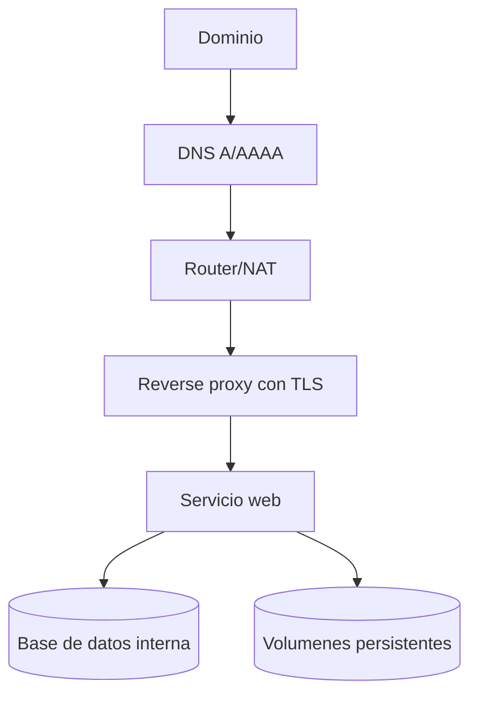

# 6. Despliegue y selfhosting

## Objetivo del capitulo

Este capitulo explica como pasar de una aplicacion local a un servicio publicado de forma segura, estable y mantenible.

La idea es tener un proceso repetible: preparar, desplegar, validar y operar.

## Que significa desplegar bien

Un despliegue se considera correcto cuando cumple estos puntos:

- El servicio arranca siempre tras reinicio.
- El acceso publico funciona por HTTPS.
- Los datos persisten aunque se recree el contenedor.
- Hay forma clara de rollback si algo falla.
- Existe checklist de validacion post-despliegue.

## Arquitectura de despliegue recomendada



## Herramientas recomendadas en esta fase

| Necesidad            | Recomendacion principal | Alternativa                   | Cuándo usarla                    |
| -------------------- | ----------------------- | ----------------------------- | -------------------------------- |
| Proxy y certificados | Traefik                 | Nginx Proxy Manager           | Publicar servicios HTTPS         |
| Operar stacks        | Docker Compose          | Portainer                     | Despliegue y mantenimiento       |
| DNS dinamico         | Cliente DDNS            | DNS gestionado en registrador | Si tienes IP publica dinamica    |
| Pruebas HTTP         | curl                    | navegador + devtools          | Validacion funcional y cabeceras |
| Observabilidad       | Netdata                 | logs + alertas simples        | Ver salud tras despliegues       |

## Flujo de despliegue por fases

### Fase 1: preparar base

1. Verificar estado del host.
2. Verificar proxy y certificados.
3. Confirmar que DNS apunta al destino correcto.
4. Revisar que puertos publicos necesarios estan abiertos.

### Fase 2: preparar aplicacion

1. Fijar version de imagen o build reproducible.
2. Definir variables de entorno sin exponer secretos.
3. Configurar volumenes persistentes.
4. Definir healthcheck y restart policy.

Ejemplo simplificado de servicio (datos inventados):

```yaml
services:
  web-app:
    image: web-app:1.0.0
    restart: unless-stopped
    networks:
      - public
      - private
    volumes:
      - app-data:/var/lib/app
    healthcheck:
      test: ["CMD", "wget", "-qO-", "http://localhost:8080/health"]
      interval: 30s
      timeout: 5s
      retries: 3
```

### Fase 3: publicar

1. Levantar servicio en segundo plano.
2. Verificar estado de contenedor.
3. Revisar logs de arranque.
4. Probar ruta interna de salud.
5. Probar acceso publico HTTP y HTTPS.

### Fase 4: endurecer y cerrar

1. Forzar redireccion HTTP a HTTPS.
2. Confirmar cabeceras de seguridad.
3. Bloquear rutas sensibles en servidor web.
4. Confirmar que servicios internos no quedan expuestos.

## Validacion post-despliegue (runbook corto)

Checklist minimo:

- Contenedor en estado healthy.
- Endpoint de salud responde.
- Dominio responde por HTTPS.
- Certificado valido y no caducado.
- HTTP redirige a HTTPS.
- Rutas sensibles devuelven 403 o 404.
- Datos persisten tras reinicio del servicio.

## Rollback rapido

Estrategia recomendada:

1. Mantener version anterior conocida como estable.
2. Si la nueva falla, revertir solo el servicio afectado.
3. Validar estado y salud tras rollback.
4. Documentar causa y correccion antes de nuevo intento.

No intentes corregir un despliegue fallido tocando cinco cosas a la vez.

## Errores frecuentes al publicar servicios

1. Publicar primero y validar despues.
2. No separar secretos de configuracion publica.
3. Exponer base de datos por error.
4. Usar latest sin control de versiones.
5. No probar reinicio ni recuperacion.
6. No revisar certificados hasta que ya han fallado.

## Recomendaciones practicas

- Publica de uno en uno: un servicio, una validacion.
- Si algo falla, vuelve al ultimo estado estable.
- Guarda un registro de cambios por despliegue.
- Estandariza tu checklist y reutilizalo siempre.

## Como escalar despues

Cuando la base ya es estable, puedes ampliar con:

- Mas servicios de selfhosting.
- Segmentacion de red mas estricta.
- Alertas de disponibilidad y caducidad de certificados.
- Politica de backups por niveles (diario, semanal, mensual).

Hazlo siempre por fases, no por acumulacion de cambios.

## Nota sobre datos inventados

Cualquier dominio, IP, usuario, puerto, ruta o credencial mostrado como ejemplo en este capitulo es inventado.

Para configurar valores reales, consulta documentacion oficial del proxy, del proveedor DNS y de cada servicio desplegado.
